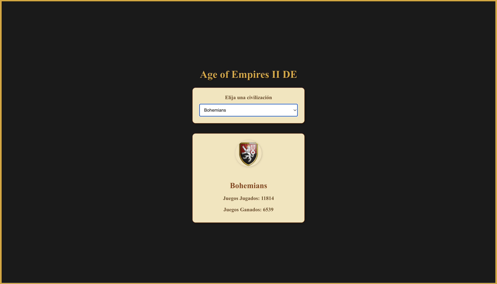

# Age of Empires II DE - Civilizaciones

Una aplicación web sencilla construida con ReactJS que permite a los usuarios visualizar las estadísticas y detalles de las diferentes civilizaciones de Age of Empires II DE.

## 🚀 Comenzando

Estas instrucciones te permitirán obtener una copia del proyecto en tu máquina local para propósitos de desarrollo y pruebas.

### 📋 Pre-requisitos

- Tener Node.js y npm instalados. Si aún no los tienes, puedes descargarlos [aquí](https://nodejs.org/).

### 🔧 Instalación

1. Clona este repositorio:
   git clone https://github.com/galue99/Age-of-Empires.git

2. Navega al directorio del proyecto:
cd humber

3. Instala las dependencias:
npm install

4. Ejecuta la aplicación en modo desarrollo:
npm start

Después de ejecutar este comando, se abrirá una nueva ventana de tu navegador predeterminado en `http://localhost:3000` mostrando la aplicación.

## 🛠️ Construido con

- [ReactJS](https://reactjs.org/)
- [create-react-app](https://create-react-app.dev/)

## 📌 Versión

1.0.0

## ✒️ Autores

- [Edgar Espinetti](https://www.linkedin.com/in/edgar-espinetti-061556a6/) - Trabajo inicial, desarrollo y documentación

